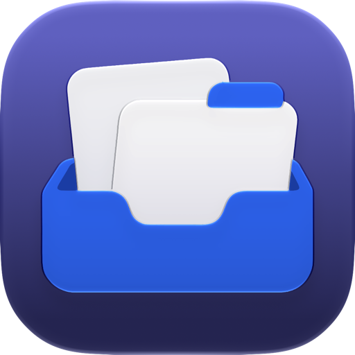

<div align="center">



# WinV

**Windows + V–style clipboard history for macOS, with a Liquid Glass UI.**

Press a shortcut anywhere, pick something you copied earlier, and it gets pasted.

[](#requirements)
[](Package.swift)
[](Sources/WinV)
[](Package.swift)
[](LICENSE)
[](https://github.com/Brightwav3/winv/releases)
[](https://buymeacoffee.com/brightwave)
[](https://github.com/Brightwav3/winv/stargazers)

[Features](#features) · [Install](#install) · [Shortcuts](#keyboard-shortcuts) · [Build](#build-from-source) · [Privacy](#privacy)

</div>

---

## Features

- ⌨️ **Open anywhere.** The history panel opens right at your text cursor. The default shortcut is **⌥V**, and you can change it in Settings.
- 📌 **Pins.** Pinned items stay at the top in the order you pinned them. They survive *Clear all* and restarts, and each one can have its own global paste shortcut.
- ↕️ **Drag to reorder.** Drag items in the panel to arrange them. Pinned and unpinned items are reordered separately.
- 🖼️ **Text, rich text, links and images.** You can search and filter them, and paste as plain text when you need to.
- 🔒 **Skips password managers.** Content marked as concealed is never recorded.
- 🪟 **Liquid Glass UI.** Follows the system appearance, or pick Light or Dark in Settings.
- 🔄 **Automatic updates.** WinV checks GitHub Releases, sends a notification when a new version is out, and installs it with one click (*Install & Relaunch*). You can turn this off in Settings.
- 🪶 **Lightweight.** Lives in the menu bar with no Dock icon and no dependencies. It checks the clipboard every 0.5 s with a single counter read and stores history as one small JSON file.

## Install

1. Download `WinV.dmg` from [Releases](https://github.com/Brightwav3/winv/releases), or [build it yourself](#build-from-source).
2. Drag **WinV** to **Applications** and launch it.
3. Grant **Accessibility** permission when asked (System Settings › Privacy & Security › Accessibility). WinV needs it to paste into other apps and to find your text cursor.

> [!NOTE]
> WinV is not notarized yet. On first launch, right-click the app and choose **Open**, or allow it in System Settings › Privacy & Security.

## Keyboard shortcuts

| Shortcut | Action |
| --- | --- |
| <kbd>⌥</kbd><kbd>V</kbd> | Open history (configurable) |
| <kbd>↑</kbd> <kbd>↓</kbd> | Move selection |
| <kbd>↩</kbd> | Paste |
| <kbd>⇧</kbd><kbd>↩</kbd> | Paste as plain text |
| <kbd>⌘</kbd><kbd>1</kbd>–<kbd>9</kbd> | Paste one of the first nine items (pins first) |
| <kbd>⌘</kbd><kbd>P</kbd> | Pin / unpin |
| <kbd>⌫</kbd> | Remove item |
| <kbd>esc</kbd> | Close |

### Changing the shortcut

Open **Settings… › General › Shortcut**, click the current combo and press a new one. The combo must include ⌃, ⌥ or ⌘. Press <kbd>esc</kbd> to cancel. The ↺ button restores ⌥V. If another app already uses the combo, WinV keeps your previous shortcut.

Pinned-item shortcuts can be recorded the same way, in **Settings › Pinned shortcuts**. Press <kbd>⌫</kbd> while recording to remove a shortcut.

## Build from source

### Requirements

- macOS 14 Sonoma or later
- Xcode, which provides `actool` to compile the Liquid Glass app icon

```bash
git clone https://github.com/Brightwav3/winv.git
cd winv
./build.sh
```

This produces `build/WinV.app` and `build/WinV.dmg`.

> [!TIP]
> Create a code-signing certificate named **Clipboard Local Signing** in Keychain Access. `build.sh` signs with it, so the Accessibility permission stays granted across rebuilds.

### Project layout

```
Sources/WinV/
├── App.swift       # entry point, menu bar, About panel
├── Panel.swift     # history panel UI + keyboard handling
├── Store.swift     # clipboard watcher, history persistence, settings
├── System.swift    # global hotkeys (Carbon), Accessibility, paste
├── Updater.swift   # GitHub Releases self-updater
├── Windows.swift   # Settings, onboarding, shortcut recorder
├── Glass.swift     # Liquid Glass window chrome
└── Theme.swift     # colors, styles, appearance switcher
```

## Privacy

WinV has no analytics or telemetry. Its only network request is the update check against the GitHub Releases API, which you can turn off in Settings. History stays on your Mac in a local JSON file. You can pause recording or clear the history at any time from the menu bar.

## Support

WinV is free and always will be. If it saves you time, you can [buy me a coffee ☕](https://buymeacoffee.com/brightwave).

## License

[GPL-3.0](LICENSE) © 2026
