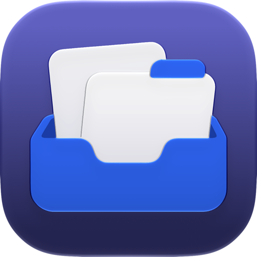
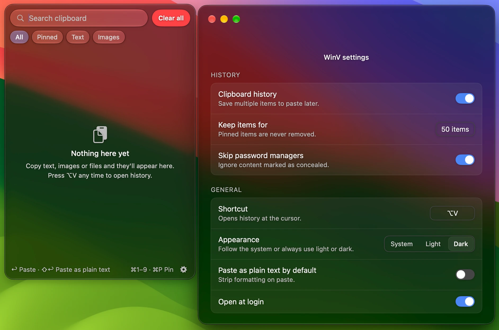

<div align="center">



# WinV

**Windows + V–style clipboard history for macOS, with a Liquid Glass UI.**

Press a shortcut anywhere, pick something you copied earlier, and it gets pasted.

[](#requirements)
[](Package.swift)
[](Sources/WinV)
[](Package.swift)
[](LICENSE)
[](https://github.com/Brightwav3/winv/releases)
[](https://buymeacoffee.com/brightwave)
[](https://github.com/Brightwav3/winv/stargazers)

[Gatekeeper](#gatekeeper-app-cant-be-opened) · [Features](#features) · [Install](#install) · [Shortcuts](#keyboard-shortcuts) · [Build](#build-from-source) · [Privacy](#privacy)

</div>

<p align="center">
  
</p>

---

## Gatekeeper: "app can't be opened"

WinV isn't signed with an Apple Developer ID or notarized by Apple, so **Gatekeeper**, the macOS security check for downloaded apps, blocks it on first launch. You'll see a message like *"WinV" can't be opened because Apple cannot check it for malicious software* or *"WinV" Not Opened*. This is expected for free apps distributed outside the App Store; the full source code is in this repository.

To allow it once:

1. Try to open WinV, then close the warning.
2. Open **System Settings › Privacy & Security**.
3. Scroll down to the **Security** section. Next to the message about WinV, click **Open Anyway**.
4. Confirm with your password or Touch ID, then click **Open**.

On macOS 14 Sonoma you can also right-click WinV in Applications and choose **Open**. From macOS 15 Sequoia on, only the System Settings route works.

Alternatively, remove the quarantine flag in Terminal:

```bash
xattr -dr com.apple.quarantine /Applications/WinV.app
```

You only need to do this once. Updates installed from inside WinV open normally.

---

## Features

### History panel
- ⌨️ **Opens where you type.** Press **⌥V** (configurable) in any app. The panel appears just above the line you're typing on, or below it when there's no room. Without a text cursor it opens at the mouse.
- 🖼️ **Everything you copy.** Text, rich text, links, colours, images and files. Images and files copied in Finder get real Quick Look previews; colours get a swatch.
- 🔍 **Search and filter.** Type to search, and switch between *All*, *Pinned*, *Text* and *Images*.
- 📋 **Paste as plain text.** Per paste with ⇧↩, or always, via Settings.
- 🔢 **Quick paste.** Hold ⌘ to see numbers (in both panels), then ⌘1–⌘9 pastes one of the first nine items.
- 📌 **Pins.** Pinned items stay at the top in the order you pinned them. They survive *Clear all* and restarts.
- 🎹 **Pin shortcuts.** Give any pinned item its own global shortcut that pastes it from any app, without opening the panel. If another app already owns the combo, WinV marks it in red.
- ↕️ **Drag to reorder.** Drag items to arrange them. Pinned and unpinned items are reordered separately.
- 👆 **Swipe to delete.** Hover a clip and swipe left with two fingers on the trackpad. A short swipe reveals *Paste as plain text* and *Remove*; keep swiping and the trash grows until it turns red, then let go to delete.
- 🗑️ **Remove or clear.** Remove single items, or clear everything except pins.
- ↩️ **Undo.** Deleted something by accident? ⌘Z in the panel brings back the last removal, including *Clear all*.

### Minimalistic mode
- 🫧 **Just your clips.** An empty Liquid Glass panel that shows copied items as they are: no search bar, filters or metadata.
- 📐 **Uniform rows.** Every clip is exactly three lines tall; pictures scale to fit.
- ⋯ **Actions on demand.** The ⋯ button slides a clip aside to reveal *Paste as plain text* and *Remove*. The pin sits at the clip's bottom edge.
- 🧹 **Corner controls.** A red *Clear all* bin that shivers on hover (bottom-left) and the Settings gear (bottom-right).

### Look and feel
- 🪟 **Liquid Glass UI.** Native macOS 26 glass, with a translucent fallback on older macOS versions.
- 🎨 **Custom glass.** Sliders for transparency, hue, saturation and blur, plus a switch for a solid background. Changes apply live to the panel and the Settings window.
- 🌗 **Appearance.** Follow the system, or always use Light or Dark.

### Under the hood
- 🔒 **Skips password managers.** Content marked as concealed is never recorded.
- ⏸️ **Pause or turn off history** at any time; choose how many items to keep (10–200). Pinned items are never removed.
- 💾 **History survives quit and restart**, stored as one small JSON file on your Mac.
- 🚀 **Open at login**, optionally.
- 🔄 **Automatic updates.** WinV checks GitHub Releases, notifies you about new versions and installs them with one click (*Install & Relaunch*). Every update is checked against a signature before it installs. You can turn this off.
- 🪶 **Lightweight.** Lives in the menu bar with no Dock icon and no dependencies. It checks the clipboard every 0.5 s with a single counter read.

## Install

1. Download `WinV.dmg` from [Releases](https://github.com/Brightwav3/winv/releases), or [build it yourself](#build-from-source).
2. Drag **WinV** to **Applications** and launch it.
3. If macOS blocks it, follow [Gatekeeper](#gatekeeper-app-cant-be-opened) at the top.
4. Grant **Accessibility** permission when asked (System Settings › Privacy & Security › Accessibility). WinV needs it to paste into other apps and to find your text cursor. Without it, WinV can only copy items back to the clipboard.

## Keyboard shortcuts

| Shortcut | Action |
| --- | --- |
| <kbd>⌥</kbd><kbd>V</kbd> | Open history (configurable) |
| <kbd>↑</kbd> <kbd>↓</kbd> | Move selection |
| <kbd>↩</kbd> | Paste |
| <kbd>⇧</kbd><kbd>↩</kbd> | Paste as plain text |
| <kbd>⌘</kbd><kbd>1</kbd>–<kbd>9</kbd> | Paste one of the first nine items (pins first) |
| <kbd>⌘</kbd><kbd>P</kbd> | Pin / unpin |
| <kbd>⌫</kbd> | Remove item |
| <kbd>⌘</kbd><kbd>Z</kbd> | Undo the last removal |
| <kbd>esc</kbd> | Close |
| Two-finger swipe left | Delete the hovered item (trackpad) |

### Changing the shortcut

Open **Settings… › General › Shortcut**, click the current combo and press a new one. The combo must include ⌃, ⌥ or ⌘. Press <kbd>esc</kbd> to cancel. The ↺ button restores ⌥V. If another app already uses the combo, WinV keeps your previous shortcut.

Pinned-item shortcuts can be recorded the same way, in **Settings › Pinned shortcuts**. Press <kbd>⌫</kbd> while recording to remove a shortcut.

## Build from source

### Requirements

- macOS 14 Sonoma or later
- Xcode, which provides `actool` to compile the Liquid Glass app icon

```bash
git clone https://github.com/Brightwav3/winv.git
cd winv
./build.sh
```

This produces `build/WinV.app` and `build/WinV.dmg`. Maintainers holding the release key (`~/.winv-signing-key`, see `scripts/sign-release.swift`) also get `build/WinV.dmg.sig`, which must be uploaded with every release.

> [!TIP]
> Create a code-signing certificate named **Clipboard Local Signing** in Keychain Access. `build.sh` signs with it, so the Accessibility permission stays granted across rebuilds.

### Project layout

```
Sources/WinV/
├── App.swift       # entry point, menu bar, About panel
├── Panel.swift     # history panel UI + keyboard handling
├── Store.swift     # clipboard watcher, history persistence, settings
├── System.swift    # global hotkeys (Carbon), Accessibility, paste
├── Updater.swift   # GitHub Releases self-updater
├── Windows.swift   # Settings, onboarding, shortcut recorder
├── Glass.swift     # Liquid Glass window chrome
└── Theme.swift     # colors, styles, appearance switcher
scripts/
└── sign-release.swift  # release signing key + DMG signature
```

## Privacy

WinV has no analytics or telemetry. Its only network request is the update check against the GitHub Releases API, which you can turn off in Settings. History stays on your Mac in a local JSON file. You can pause recording or clear the history at any time from the menu bar.

## Support

WinV is free and always will be. If it saves you time, you can [buy me a coffee ☕](https://buymeacoffee.com/brightwave).

## License

[GPL-3.0](LICENSE) © 2026
